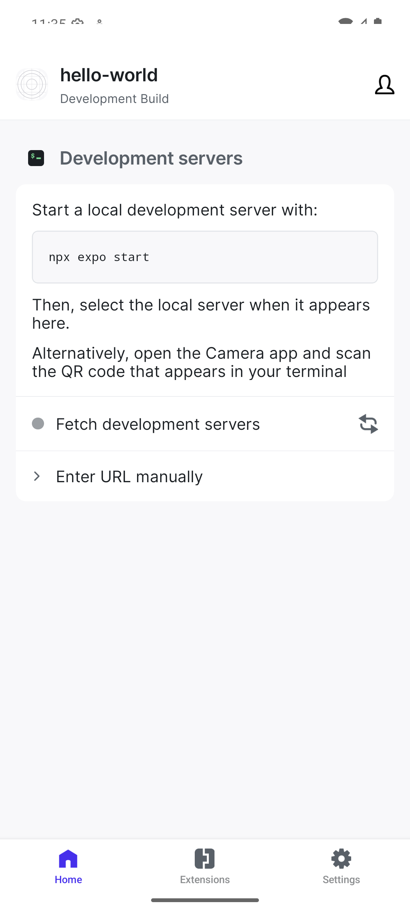

# QA Bundled Runtime Issue Report

**Datum:** 2025-09-16
**Čas:** 09:30 UTC
**Status:** ❌ BUNDLED APK OBSAHUJE JS, ALE RUNTIME HO IGNORUJE

## Problém

QA APK bylo úspěšně vytvořeno s bundled JavaScriptem, ale **aplikace při spuštění ignoruje embedded bundle** a pokouší se připojit k Metro development serveru.

## Implementace (podle expertčina doporučení)

### ✅ Co funguje správně

1. **QA build type konfigurace:**
```gradle
// android/app/build.gradle
qa {
    initWith debug
    debuggable false                 // KLÍČOVÉ: tím se JS zabundluje
    signingConfig signingConfigs.debug
    matchingFallbacks = ["debug"]
    minifyEnabled false
    shrinkResources false
}
```

2. **Bundle generation:**
```bash
./gradlew :app:assembleQa --no-daemon --max-workers=1
# BUILD SUCCESSFUL in 20-45min
```

3. **APK validation:**
```bash
$ unzip -l app-qa.apk | grep index.android.bundle
  1041844  1981-01-01 01:01   assets/index.android.bundle
```

4. **Installation:**
```bash
$ adb install app-qa.apk
Success
```

### ❌ Co nefunguje

**Runtime behavior:** Aplikace při spuštění zobrazuje Expo Development Client launcher s požadavkem na Metro server.

## Screenshot Evidence



**Aplikace zobrazuje:**
- "hello-world Development Build"
- "Development servers" sekce
- Instrukce: "Start a local development server with: npx expo start"
- "Fetch development servers" button
- "Enter URL manually" možnost

**Očekávané chování:** Aplikace by měla spustit main content z bundled JavaScriptu bez požadavku na Metro server.

## Technical Analysis

### Bundle Verification
```bash
$ unzip -l app/build/outputs/apk/qa/app-qa.apk | grep -E "(bundle|js)"
  1544973  1981-01-01 01:01   assets/EXDevMenuApp.android.js
  2115349  1981-01-01 01:01   assets/expo_dev_launcher_android.bundle
  1041844  1981-01-01 01:01   assets/index.android.bundle              # ✅ MAIN BUNDLE
```

### Runtime Configuration Issue
- **Bundle přítomen:** ✅ `assets/index.android.bundle` (1.04MB)
- **Bundle loading:** ❌ Aplikace ho nepoužívá
- **Fallback behavior:** Aplikace defaultuje na development server mode

## Možné příčiny

1. **Expo Development Client priorita:** `expo-dev-client` může mít vyšší prioritu než bundled JS
2. **Runtime flag missing:** Chybí flag, který říká aplikaci "použij bundled JS"
3. **Build variant config:** QA variant možná není correctly recognized jako "production-like"
4. **Bundle loading path:** Aplikace možná hledá bundle na jiném místě

## Environment Details

- **Expo SDK:** 53.0.0
- **React Native:** 0.79.5
- **Build type:** qa (debuggable=false)
- **Bundle command:** `export:embed` (Expo CLI)
- **Platform:** Android API 34, emulator-5554

## Otázky pro expertku

1. **Je potřeba dodatečná konfigurace** pro QA build type, aby runtime preferoval bundled JS?

2. **Existuje způsob jak disable expo-dev-client** pro qa variant?

3. **Měli bychom použít jiný bundle command** než `export:embed`?

4. **Je potřeba runtime environment variable** (např. `__DEV__=false`)?

5. **Funguje bundling pouze v "release" build type** v Expo SDK 53?

## Request

Potřebujeme guidance jak zajistit, aby **QA APK používalo bundled JavaScript místo hledání Metro serveru** - klíčové pro Appium testing bez external dependencies.

## Logs & Assets

- APK path: `/workspaces/.../android/app/build/outputs/apk/qa/app-qa.apk`
- Screenshot: `emulator-screenshot.png`
- Installation logs: Clean install successful via `adb install`
- ADB logcat: No JavaScript errors visible